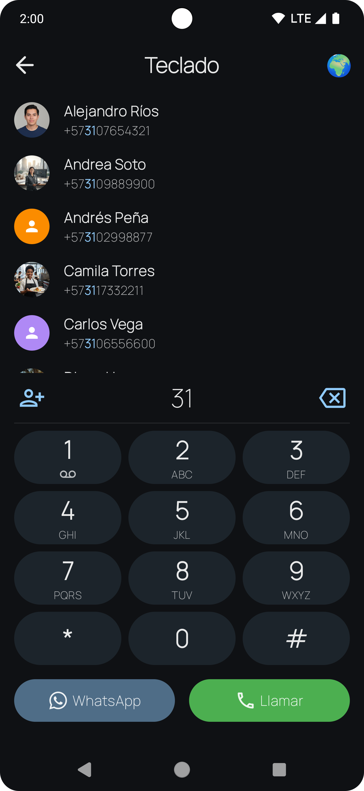
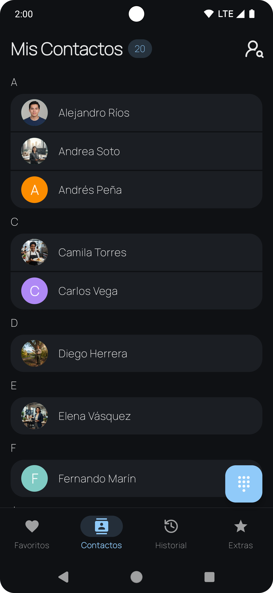
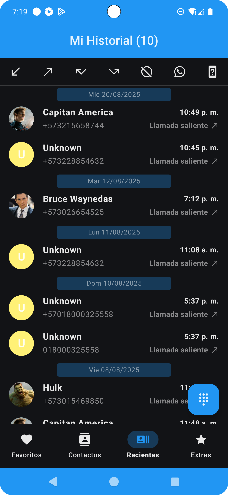
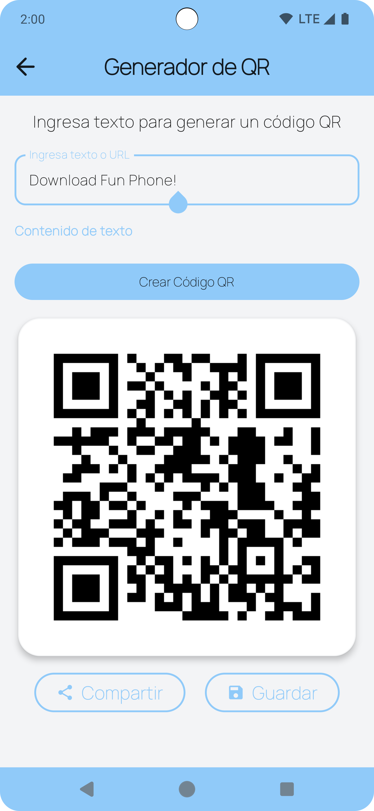
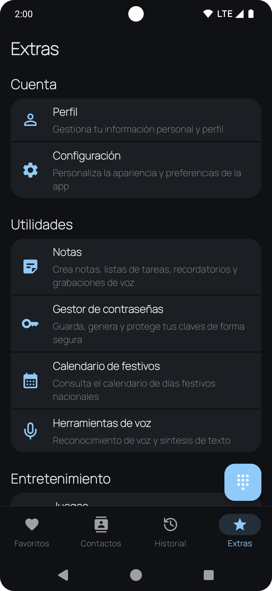
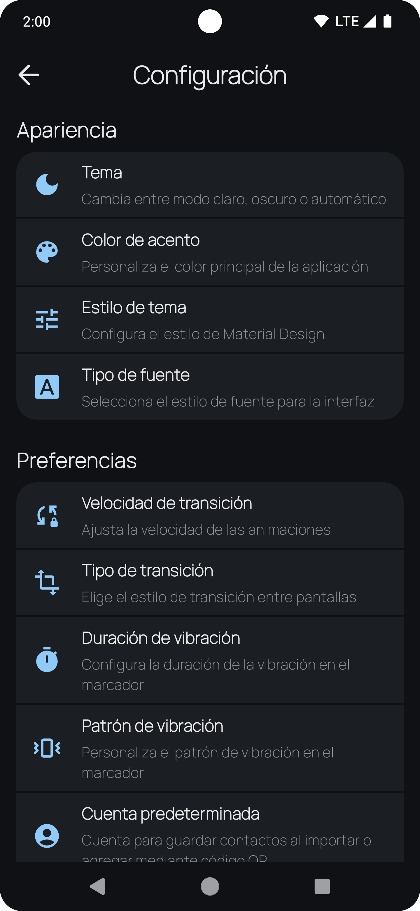

# Fun Phone: Your Private Dialer — Web

[](https://github.com/Moncada25/fun-phone-web/actions/workflows/deploy.yml)


Landing oficial, features y política de privacidad para la app **Fun Phone v3.16.1** (★ 5.0 en Play Store). Sitio estático, bilingüe ES/EN, dark/light y optimizado para GitHub Pages.

## 🚀 Stack

- Astro 4 + TailwindCSS 3
- Salida 100% estática para GitHub Pages (base: `/fun-phone-web/`)
- Dark/Light con auto-detección y toggle, sin flash
- PWA (manifest + service worker)
- Bricolage Grotesque + Instrument Serif + JetBrains Mono
- Editorial design language ("The Fun Phone Codex")

## ✨ Qué destaca en la app (v3.16.1)

- **Marcador**: T9 rápido, historial segmentado, Dual‑SIM, bloqueo de spam, contestación personalizable.
- **Contactos**: multi‑cuenta (Google/local), importar/exportar (vCard/JSON), QR, anti-spam, deduplicación.
- **Productividad**: notas con markdown, checklists, recordatorios, grabadora de voz, bloqueo biométrico.
- **Seguridad**: gestor de contraseñas con cifrado Tink (sin sync obligatoria, opcional en la nube).
- **Estilo de vida**: gestor de gastos, calendario menstrual, gestión académica, Pomodoro 25/5.
- **Extras**: 10 mini‑juegos, lienzo de pintura, calendario de festivos (Nager.Date), QR, voz (STT/TTS).
- **Personalización**: temas, paletas, fuentes, animaciones, widgets, atajos.
- **Open source**: GPL v3, builds FOSS sin Firebase, código en github.com/Moncada25/fun-phone.

Consulta la tabla comparativa en `src/pages/features/index.astro` para ver por qué Fun Phone supera al marcador estándar.

## 🖼️ Screenshots

| Marcador | Contactos | Historial |
|---|---|---|
|  |  |  |

| QR | Extras | Ajustes |
|---|---|---|
|  |  |  |

## 📁 Páginas clave

- `src/pages/index.astro` — Home con hero centrado, “Lo nuevo” (Notas y Password Manager) y carrusel con fullscreen.
- `src/pages/features/index.astro` — Features completas y comparativa “Why Fun Phone beats the stock dialer”.
- `src/pages/faq/index.astro` — FAQ bilingüe (incluye gestor de contraseñas).
- `src/pages/privacy/index.astro` — Privacidad: 100% on‑device, permisos y controles. Sin Crashlytics.
- `src/pages/roadmap/index.astro` — Roadmap (Now/Next/Later + Temas estratégicos).
- `src/components/` — Navbar, Footer, LanguageToggle, FeatureBlock, ScreenshotCarousel (lightbox), etc.
- `public/assets/` — Icono de la app (usado como favicon) y screenshots.

## 🛠️ Desarrollo

```bash
npm install
npm run dev      # Astro dev server con HMR
npm run build    # Compila a /dist (respeta BASE_URL)
npm run preview  # Sirve /dist para ver rutas/base
```

Notas de rutas
- El sitio usa `import.meta.env.BASE_URL` y `astro.config.mjs` con base `/fun-phone-web/`. Verifica enlaces en `/privacy/`, `/features/`, `/faq/` y `/roadmap/` tras `npm run preview`.

## 🌐 Deploy

- GitHub Pages con base `/fun-phone-web/` (ver `astro.config.mjs`).
- Tras cambios en base o URLs externas, construir nuevamente: `npm run build`.

## 🔒 Privacidad

- Web sin analítica por defecto. La app Fun Phone almacena datos localmente y no comparte con terceros.
- Permisos (teléfono, contactos, historial) se piden solo al configurarla como app de Teléfono predeterminada. Todos son revocables en Android.

## 🧭 Roadmap y soporte

- Roadmap: `src/pages/roadmap/index.astro`
- Contacto: santiago.moncada.dev@gmail.com
- Ficha en Play Store: https://play.google.com/store/apps/details?id=com.bookverse.contacts

—
Desarrollado por Santiago Moncada · Bookverse
